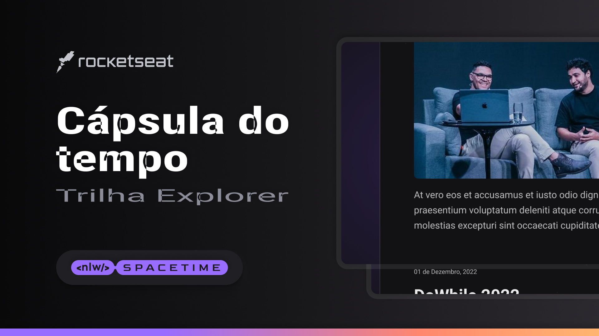

##  🖥️Projeto
Esse e um projeto web responsivo de uma capsula do tempo 

## 🚀 Tecnologias
Esse projeto foi desenvolvido durante o NLW da Rocketseat com as seguintes tecnologias:
-HTML
-CSS
-Git e Github

## Layout
Voce pode visualizar o layoout do projeto atraves
[desse link](https://www.figma.com/file/Pj0dPv3J8rZSWyfHIHGkyf/C%C3%A1psula-do-tempo-%E2%80%A2-Trilha-Explorer-(Community)?type=design&node-id=306%3A84&t=0eqnQEOumGlCiCoW-1)
E necessario ter uma conta no [Figma](https://www.figma.com)